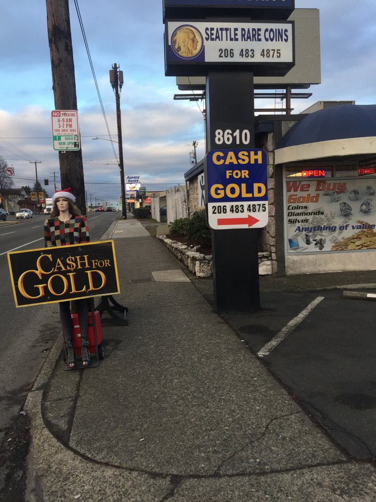
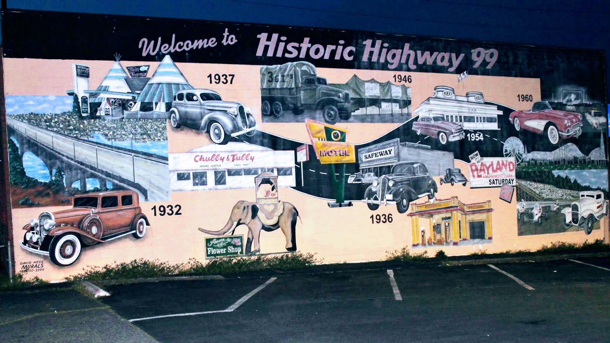

Title: Aurora is getting cleaned up.
Date: 2018-05-30 1:00
Author: timothycrosley
Category: Aurora
Tags: General, Improvements, Transit
slug: aurora-is-getting-cleaned-up
og_image: images/aurora/pedestrian_bridge.jpg

The next time you walk or ride up Aurora you may notice it's cleaner than usual. In more ways than one, positive changes are starting to take hold on this historical Seattle Avenue. The city's proactive litter abatement pilot program [has added Licton Spring's stretch of Aurora](http://komonews.com/news/local/pro-active-litter-teams-patrolling-six-seattle-neighborhoods) to its 2x weekly cleanup. This brave crew cleans up everything from coffee cups to used syringes, hopefully helping to encourage a sustainably clean street over time.

At the same time, SPD and Licton Spring's own North Precinct have been hard at work to bust a local pawn shop that incentivised theft within North Seattle. Along with the closure of the business, this had the side effect of finally permanently removing an Aurora fixture that we will all be happy to see go:

(See more on the [spdblotter](http://spdblotter.seattle.gov/2018/05/21/north-seattle-coin-shop-busted-for-selling-stolen-goods/))

Finally, [Aurora is going to be repaved and sidewalk ramps made ADA compliant over the next year](http://www.wsdot.wa.gov/Projects/SR99/RoySt145thPaving/default.htm). Which, while sure to be an inconvenience during construction and [lacking the sidewalk improvements Aurora desperately needs](http://kuow.org/post/state-repaving-aurora-thats-chance-build-sidewalks-no), will hopefully be worth it upon completion as it plays a part in increasing road safety and accessibility.

While more work is needed along this historic stretch of Seattle, it's encouraging that we are starting to see progress toward an Aurora that we can all take pride in.

