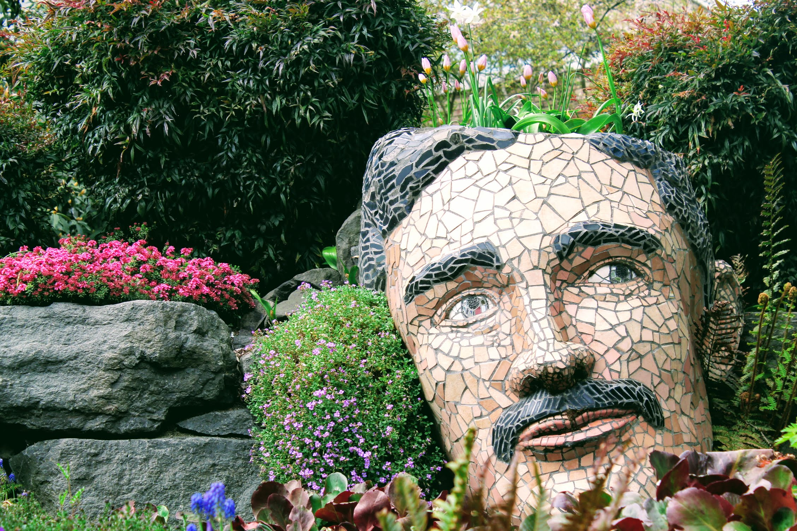
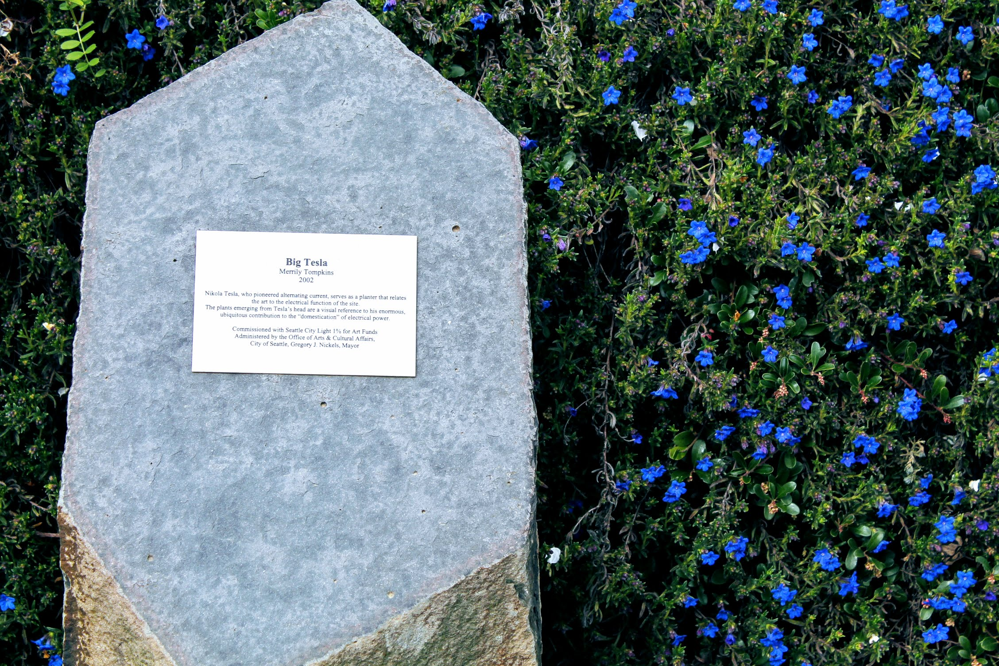

Title: Big Tesla: where nature and technology meet
Date: 2018-05-02 23:00
Author: timothycrosley
Category: Art
Tags: General, Outdoors, Art
slug: tesla_head_2018
og_image: images/tesla/overview.jpg

Right to the northwest of Licton Springs park at the Seattle City Light North Service Center lies a beautiful art piece by Merrily Tompkins.
The art not only serves as a sign of nicer weather, as flowers bloom from Tesla's head but also serves as a great reminder that technology and
nature can coexist in harmony. In a way, it's the perfect Seattle art piece, a city nestled in some of the most profoundly beautiful natural
environments while leading the way in our technological future.

For more information about this work:

- [Public Art Archive](http://www.publicartarchive.org/work/big-tesla)
- [Celebrating Seattle: Big Tesla](http://www.seattlestar.net/2014/03/celebrating-seattle-big-tesla/)

Next time you walk from Licton Springs Park to the Oak Tree Plaza, take some time to enjoy this unique and creative piece of art.
