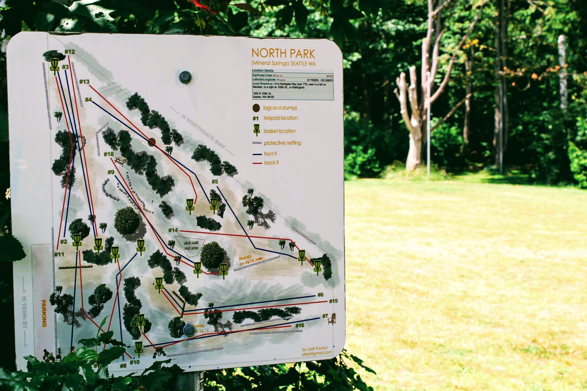
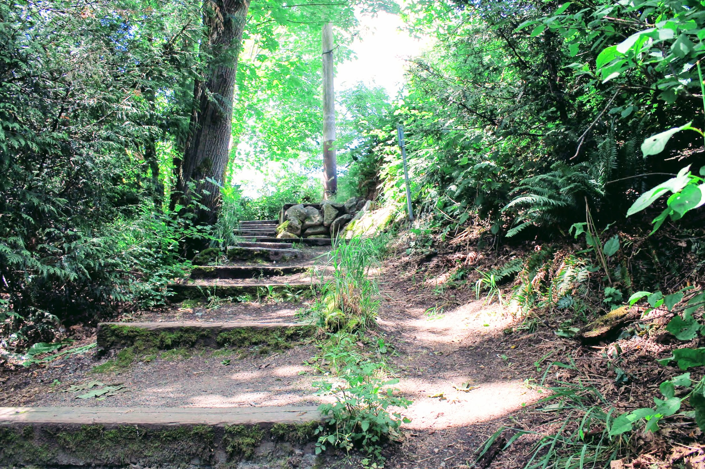
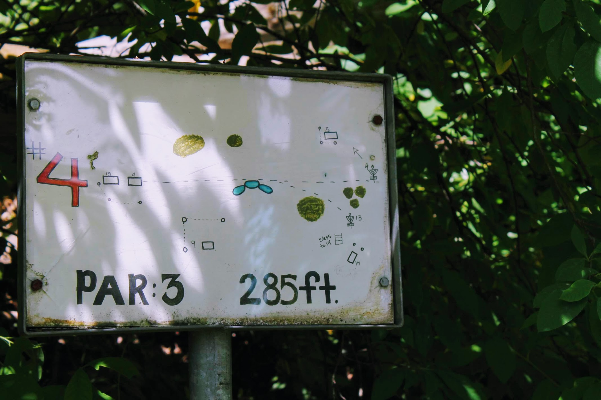
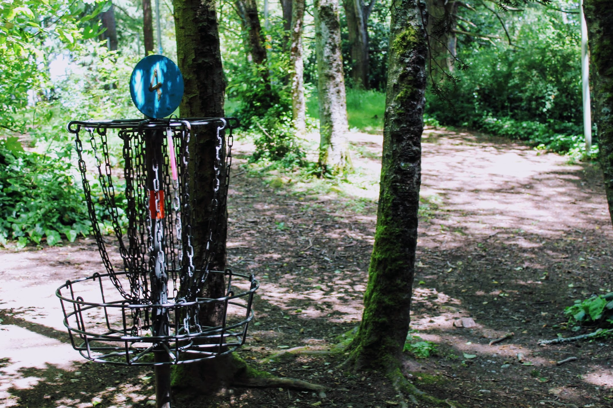
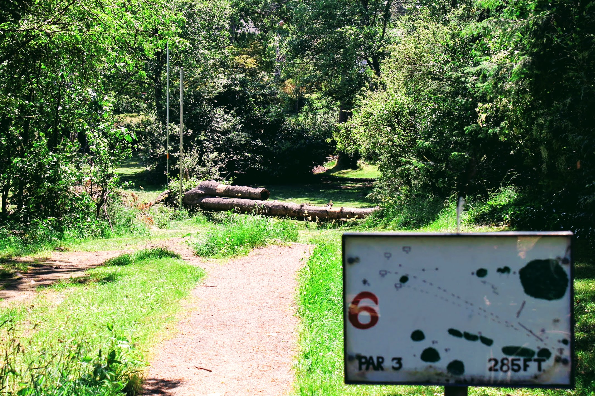
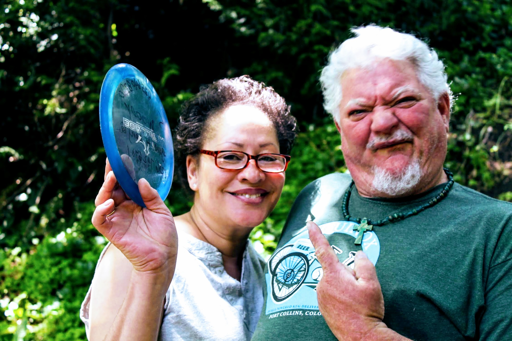
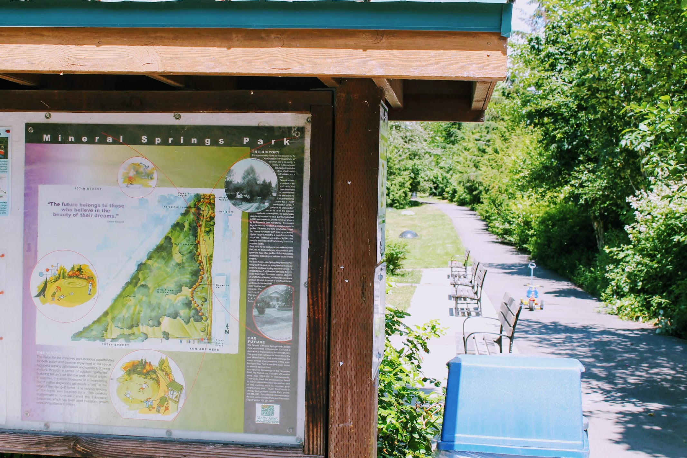

Title: Come Learn how to Disc Golf!
Date: 2018-06-10 8:00
Author: timothycrosley
Category: Events
Tags: General, Activities, Fun, Disc Golf
slug: come-learn-disc-golf
og_image: images/mineral_springs/disc/hole_5.jpg

Have you ever wanted to learn how to disc golf or just disc golf alongside some other beginners and make friends? This next Tuesday (the 19th, a week and some change from now) at 6:30 PM we will be holding our first beginner's disc golf game, with help from members of the local disc golf community. At this event, you will not only be able to learn how to play alongside other beginners but will also be able to receive valuable tips from some more veteran disc golf players.

This event will be held at Mineral Springs park, located on the north end of Licton Springs. This course takes the honor of being the original and only Disc Golf course in Seattle proper. Being a city course it also has a more compact intricate design making it uniquely well suited to learning disc golf technique. 

Having never Disc Golfed ourselves, my wife and I went by the course this morning to get some sense of the game. In the course, we were struck by not only the beauty and tranquillity of a course nestled in the city but also by the friendliness of disc golfers. We ran into Mary and Tony who took us through both some of the basics of Disc Golf and the unique traits of this course.

There are poles throughout the course used to hold up netting that separates pathways and different sections of the course.
They told us that every time your disc hits one of those poles and makes a little ringing sound, it's called North Park Love.

Hope to enjoy the summer weather, learn how to Disc Golf, and ring in some North Park Love with some of you there!

## Event Details
**Facebook Event**: [https://www.facebook.com/events/180160409336598/](https://www.facebook.com/events/180160409336598/)  
**Event start time**: Tuesday 6/19/2018 6:30 PM  
**Location**:
1500 N 105th St, Seattle, WA 98133  
Meet at the benches by the south entrance to the park

