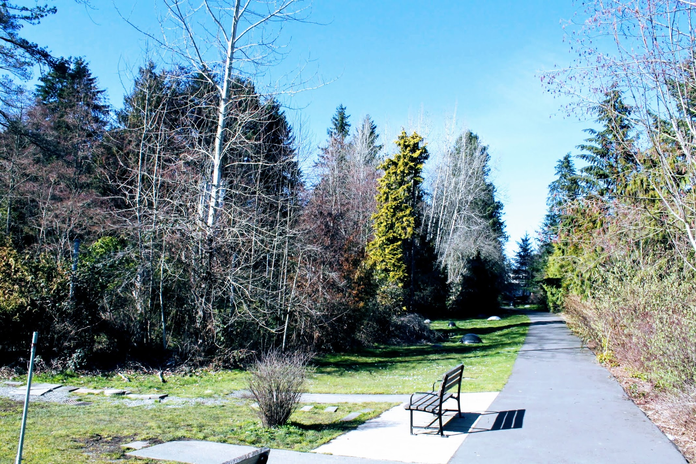
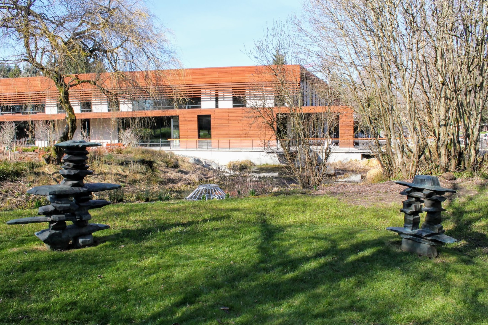
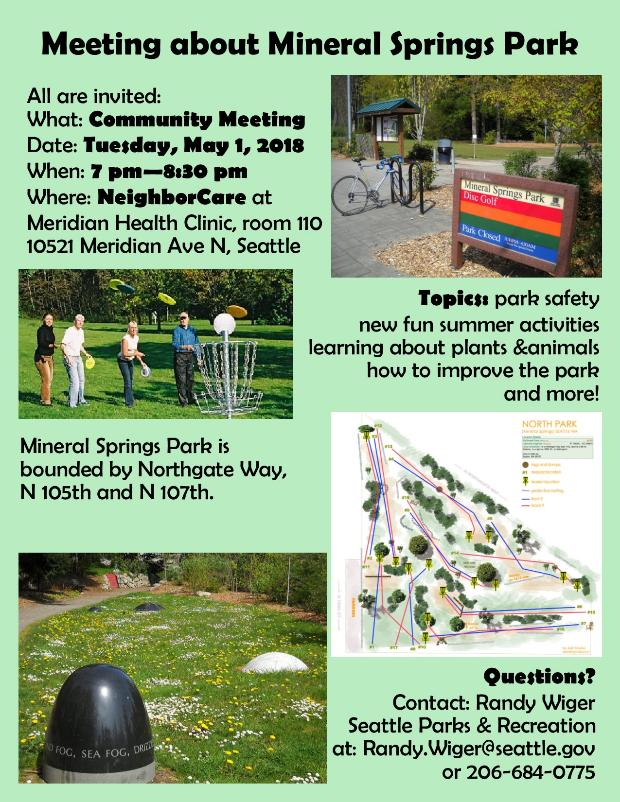

Title: Mineral Springs Park Community Meeting
Date: 2018-04-22 11:00
Author: timothycrosley
Category: Parks
Tags: General, Community Meeting, Event, Outdoors, Parks
slug: mineral-springs-meeting-may-1
og_image: images/mineral_springs/entrance.jpg

> UPDATE: The meeting was originally set to start at 7 PM but was then changed to a 6 PM start time by Seattle Parks and Recreation.

Join other members of the community on May 1st, 6:00PM-8:30PM, to help shape the future of Mineral Springs park!
The meeting will be open to the general public, so whether you live near the park or frequent it for disk golf, this is an
important meeting to attend.

The meeting will be held at Meridian Health Clinic, room 110, 10521 Meridian Ave N, Seattle, which is right next to the park:

Hope to see you there!

[FacebookEvent](https://www.facebook.com/events/620773244941071/)

