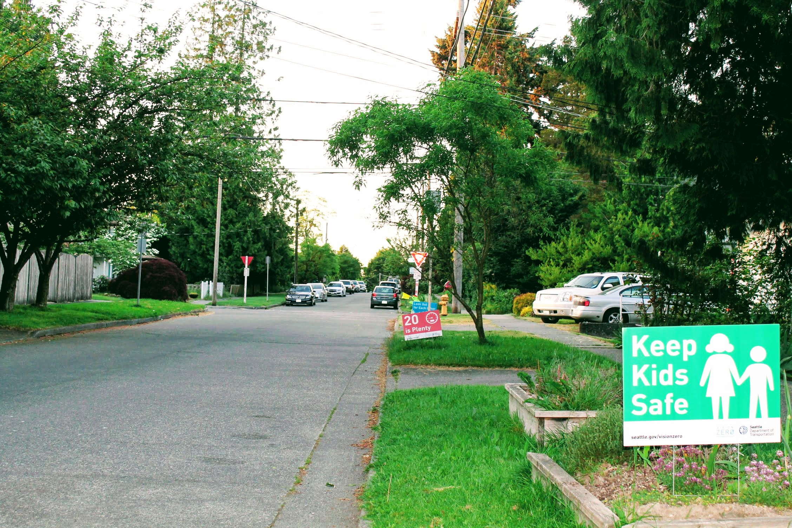
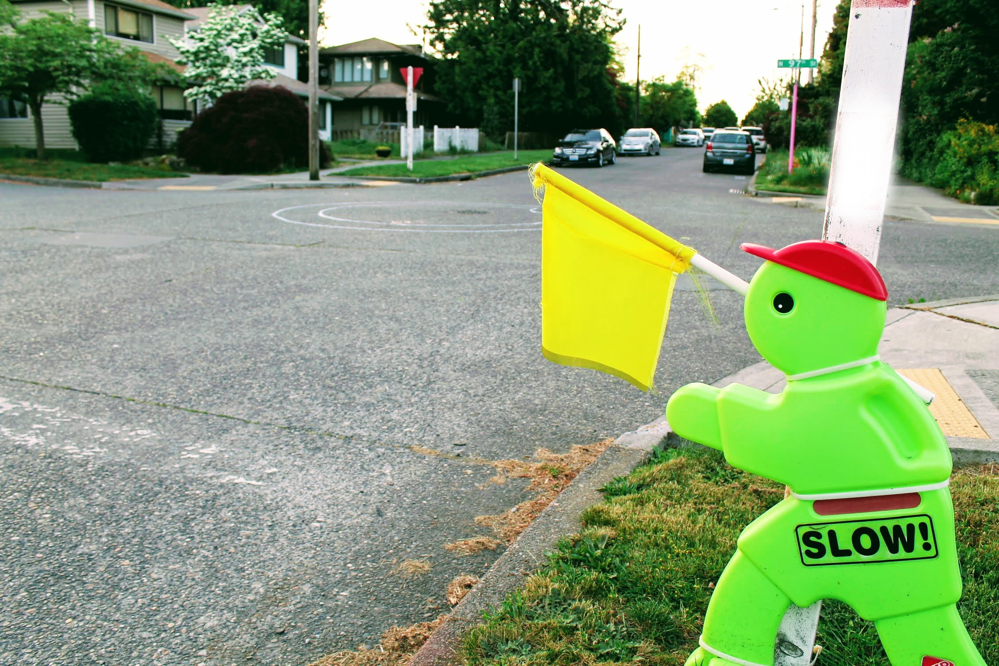
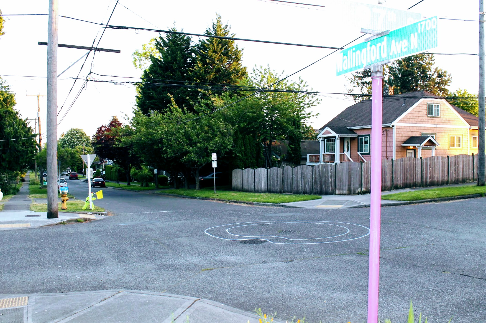
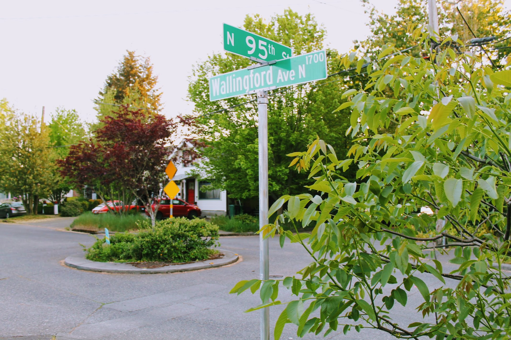
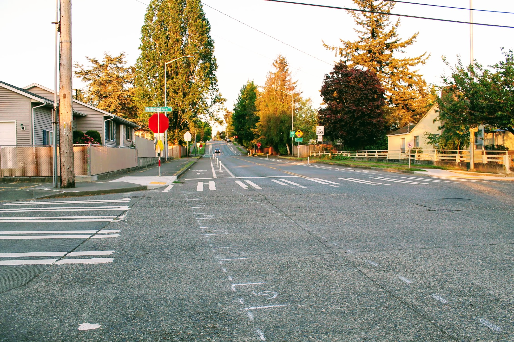
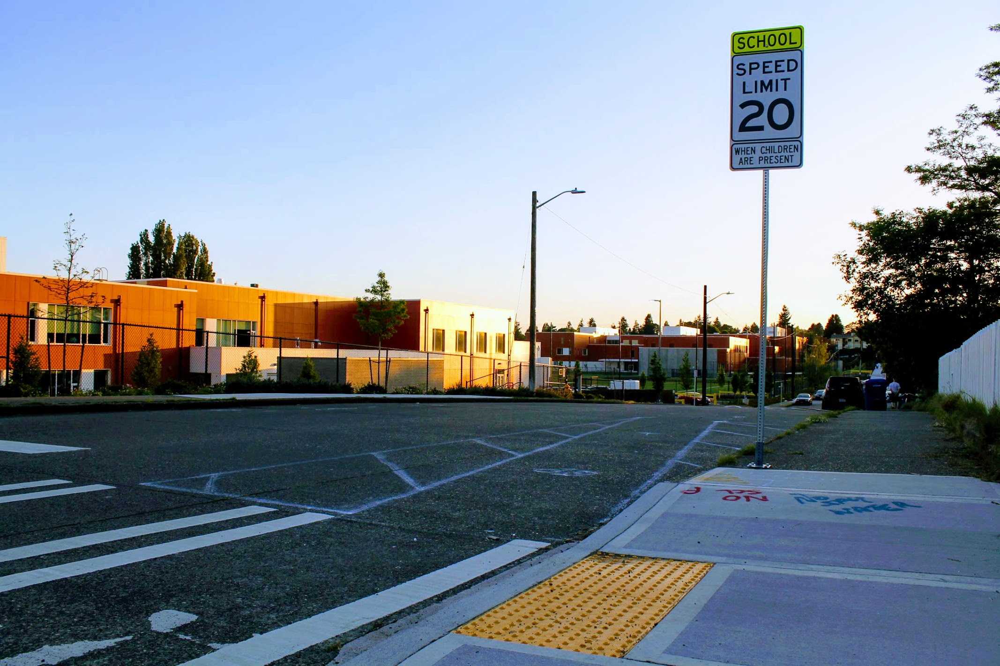

Title: Outlines Provide Sneak Peak of Street Improvements
Date: 2018-05-14 23:00
Author: timothycrosley
Category: Street Improvements
Tags: General, Improvements, Transit, School
slug: street_improvements_preview_2018
og_image: images/street_improvements/97th.jpg

A friend of the blog dropped a hint letting us know that a new traffic circle has been outlined for N 97th and Wallingford Ave N, which SDOT plans on having completed this summer! The circle will be a very welcome addition to the area, as, despite lots of warning signs and kids, sees more than its fair share of speeding.

This new circle will complement the existing one at N 95th, hopefully reducing speed driving up Wallingford.

On my walk up to N 97th, I also noticed initials outlines for a continuation of the N 92nd bike path by the new School.

You can find out about some more street improvements scheduled to be completed this year on [SDOT's Greenway & School Safety Project Website](https://www.seattle.gov/transportation/projects-and-programs/programs/greenways-program/north-seattle).

Enjoy this great weather! And hopefully, as the season progresses, we will all be able to enjoy some safer streets!
