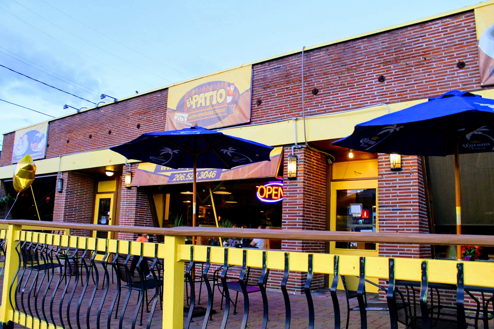
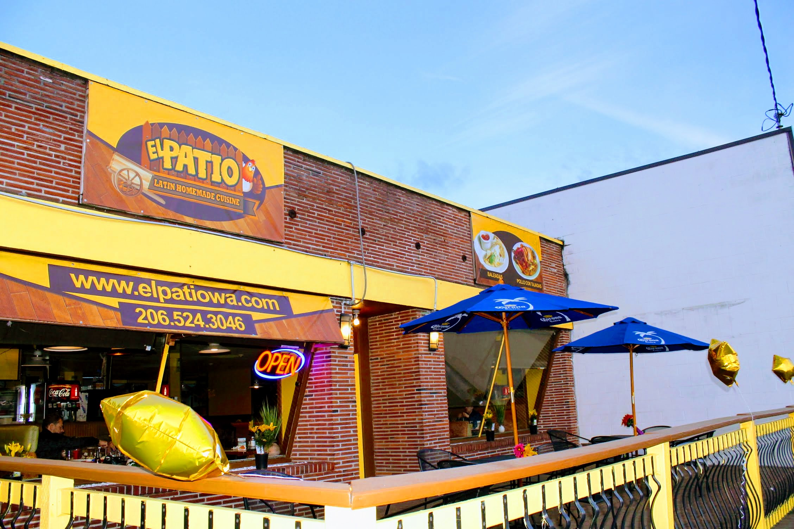
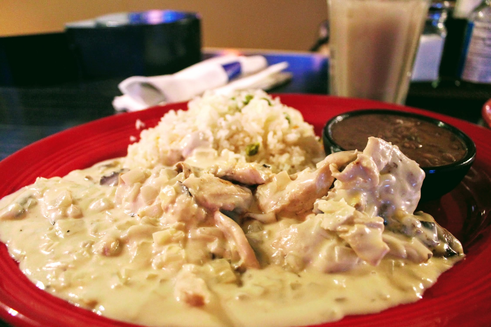
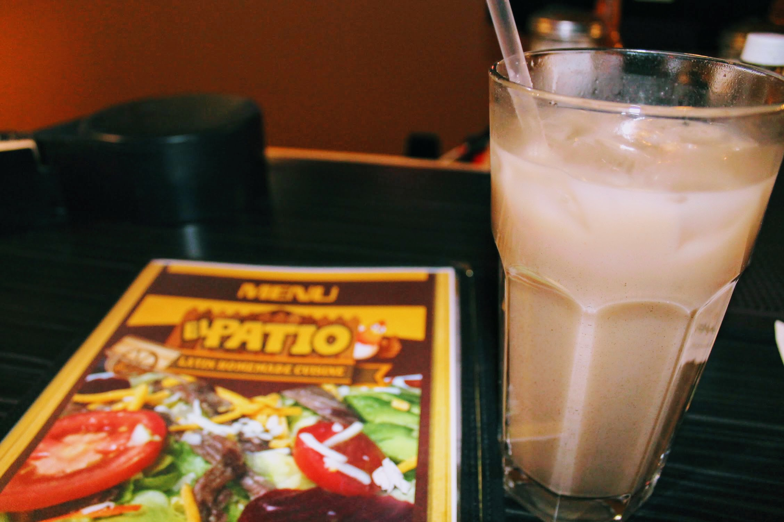

Title: El Patio replaces Tropicos Breeze
Date: 2018-04-19 20:00
Author: timothycrosley
Category: Restaurants
Tags: General, Restaurants, Patio, Business
slug: tropicos-breeze-is-gone
og_image: images/tropicos/aurora.jpg

Serving up delicious Latin Cuisine right on Aurora Avenue, Tropicos Breeze has long been one of Licton Spring's most beloved restaurants. So, when I was told the Licton Springs location had closed, I feared the worse.

Rushing to the restaurant after work, I was greeted not by Tropicos Breeze, but by El Patio. What a quick transformation! Entering El Patio, I saw familiar faces and after talking to the staff learned what had taken place. The Licton Spring's Tropicos Breeze location was sold to the owner's cousin. The new restaurant, I was told, retains the same staff and great quality food we have come to love. 

I ordered Pollo en Crema and Horchata - two of my favorite standbys from the old Tropicos Breeze. You know, just to make sure I was told the truth...
And I can happily confirm: the food here is as tasty as ever!

Whether you're a long time fan of the old Tropicos Breeze or just looking for some good Latin Cuisine, I encourage you to welcome El Patio to the neighborhood!
