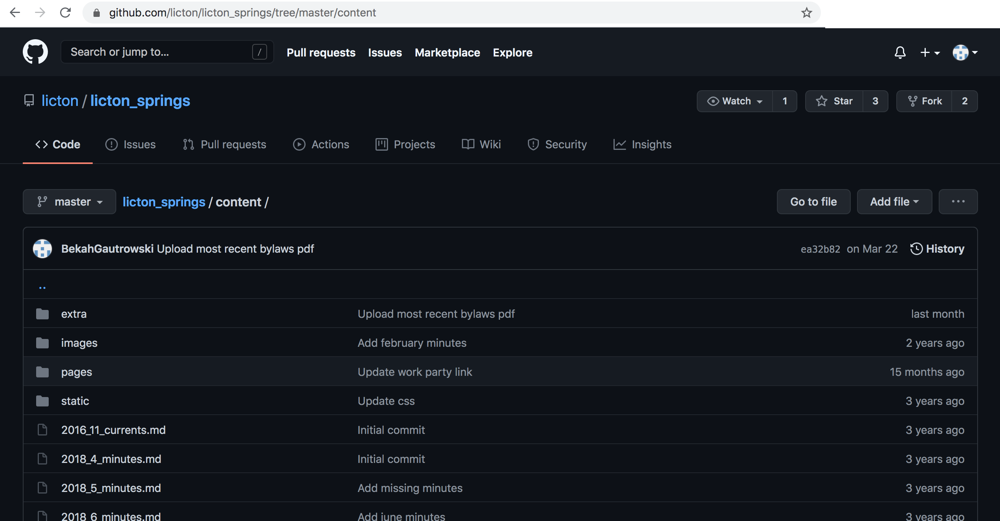
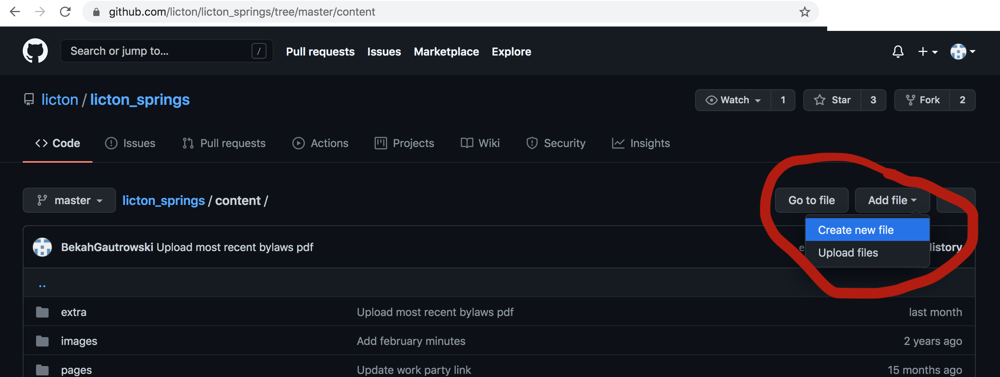
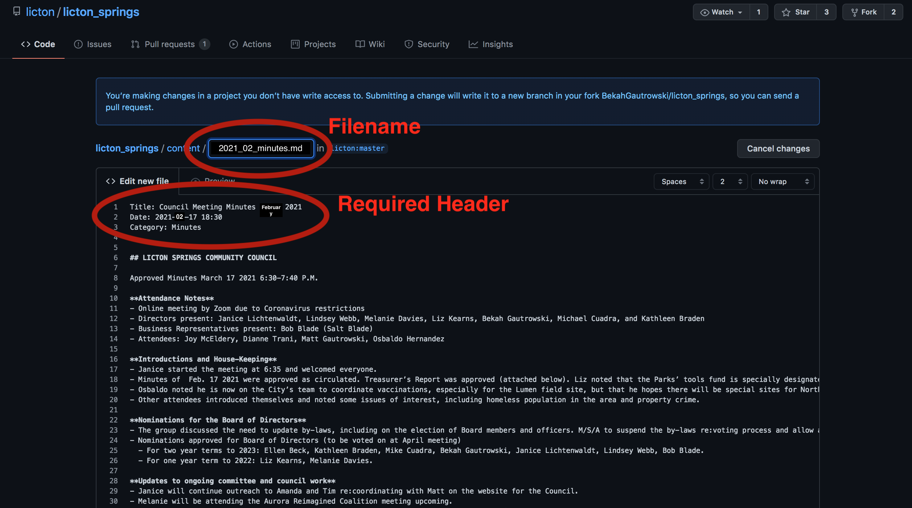
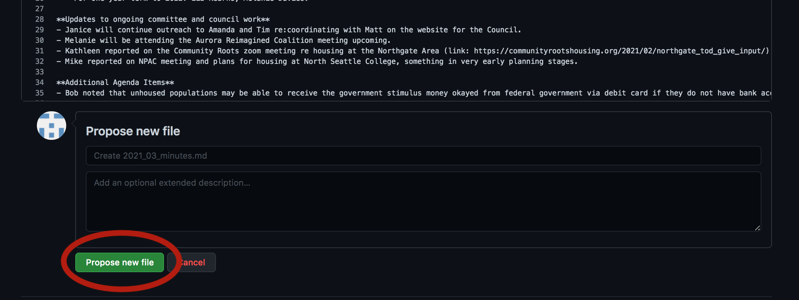
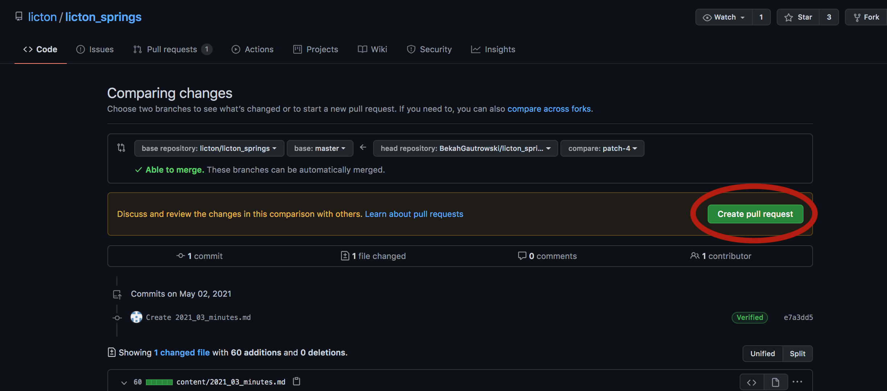

# How to Add Community Council Minutes to the Website

## Create a github account (if you don't already have one)

https://github.com/signup

## Go to the `Content` folder of the website code

https://github.com/licton/licton_springs/tree/master/content




## Use the Add File dropdown to Create new file




## Edit the new file to write the minutes

Your filename should have the format `YYYY_MM_minutes.md`.

Use the following template:

```
Title: Council Meeting Minutes MONTH YEAR
Date: YYYY-MM-DD 18:30
Category: Minutes

## LICTON SPRINGS COMMUNITY COUNCIL

Approved Minutes MM DD YYYY, MTG TIME P.M.

### Attendance Notes

- Directors Present:
- General Members Present:
- Business and Honorary Members Present:
-  Other Visitors Present: 

### Welcome and House-Keeping

- Item (Introductions possibly)
- Item (minutes approved possibly)
- Item

### Agenda Item 1

- Note 1
- Note 2
- Note 3

### Agenda Item 2

- Note 1
- Note 2
- Note 3

##### Minutes by NAME, Secretary OR Board Position
#### Next meeting MM DD

## Licton Springs Community Council Monthly Treasurer Report 

MM/DD/YYYY through MM/DD/YYYY

Date | Fund Type | Line Item | Transaction Amount | Bank Balance  
------------ | ------------ | ------------- | ------------- | -------------
MM/DD/YYYY  | Combined Funds | Beginning Bank Balance  | -  | $BALANCE
MM/DD/YYYY  | LSCC General OR Park | ITEM  | $XX.XX  | $BALANCE

Fund Type | Fund Amount
------------ | -------------
Funds for Licton Springs Community Council | $AMOUNT
Dedicated Funds for Licton Springs Park | $AMOUNT
TOTAL Combined Funds | $AMOUNT

###### NOTES:  

Any additional Treasurer notes go here, including the notes about the Fred Meyer Donations. 

```




### How to format the minutes

What you see is NOT what you get.  If you want to add special formatting to the minutes, use the following
resource: https://guides.github.com/features/mastering-markdown/#examples


## Submit your new minutes

At the bottom of the edit page, click the "Propose new file" button.



On the next page, click the "Create pull request" button



## Wait for website maintainers to put the new minutes online

You're all done! the website maintainers will automatically get an email, and put your changes on the website.
